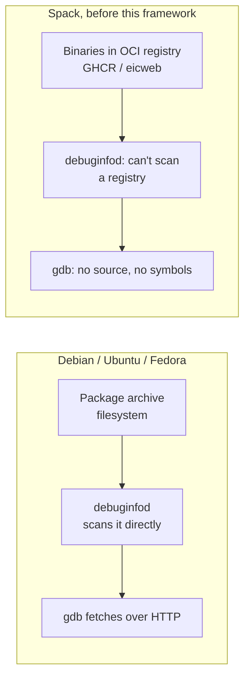
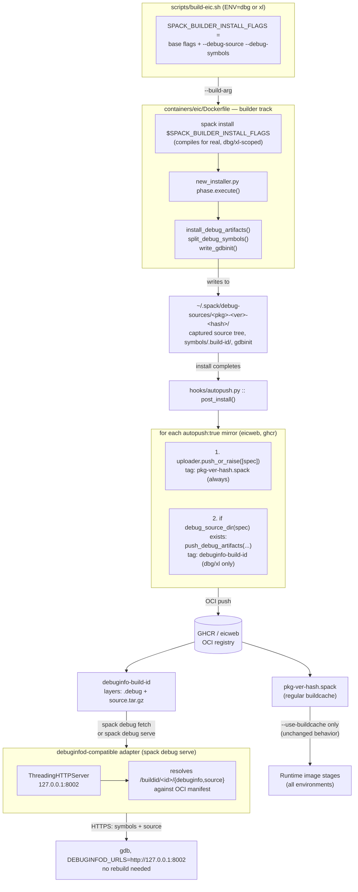

# Debuggable Installations & OCI-backed debuginfod

This document explains the debuggable-installations framework used by the `dbg` and `xl` Spack environments:

* **Capture**: Spack captures DWARF-referenced sources and symbols during installation.
* **Store**: The artifacts are pushed to existing OCI registries (EIC's GHCR/eicweb).
* **Retrieve**: `gdb`/`debuginfod` fetches them on demand, without requiring the original build directory.

## Why this exists

Debug info embeds the machine-specific, build-time source path in the binary's DWARF data. Spack removes its temporary build directory after installation, leaving that path invalid and making the binary difficult to debug later, while making the debug info non-redistributable due to machine-specific metadata.

Linux distributions address this with `debuginfod`, which serves debug symbols and source from filesystem-based package archives. Spack's buildcache is stored in OCI registries (GHCR/eicweb), which debuginfod cannot access directly.



This framework closes that gap:

* Makes DWARF paths machine-agnostic.
* Captures source and symbol data at install time and after the fact.
* Stores it in the same OCI registries used by the build cache, tagged by build ID.
* Resolves GDB build-ID lookups against OCI data over HTTPS via a lightweight debuginfod-compatible adapter.

## Where each piece lives

| Piece | Repo | File | Role |
|---|---|---|---|
| Debug capture | `spack/spack` (fork) | `debug_source.py` | Install-time DWARF/symbol capture into `~/.spack/debug-sources/` |
| Build-ID injection | `spack/compiler-wrapper` (fork) | `cc.sh` | `-ffile-prefix-map` + `--build-id` at compile/link time |
| Debug-info package resolution | `spack/spack-packages` (fork) | `compiler_wrapper/package.py` | Pins `compiler-wrapper@1.1.0-build-id` as an installable version |
| elfutils patch | `spack/spack-packages` (fork) | `elfutils/package.py` | Patches `debuginfod_find_source` to accept `./`-relative filenames |
| Auto-push | `spack/spack` (fork) | `hooks/autopush.py` | Pushes both regular buildcache *and* debug artifacts, automatically, post-install |
| On-demand fetch/repair | `spack/spack` (fork) | `cmd/debug.py` | `spack debug {stage-source,split-symbols,fetch,serve}` |
| Environment wiring | `eic/containers` | `spack-environment/{dbg,xl}/{,epic/}spack.yaml` | Pins `compiler-wrapper@1.1.0-build-id`, sets `build_type` per package |
| Version pinning | `eic/containers` | `spack.sh`, `spack-packages.sh` | Cherry-picks pointing at the debuggable-installations + debuginfod commits |
| Build orchestration | `eic/containers` | `scripts/build-eic.sh` | Computes `SPACK_BUILDER_INSTALL_FLAGS` (adds `--debug-source --debug-symbols` for `dbg`/`xl`) |
| Docker build | `eic/containers` | `containers/eic/Dockerfile` | Consumes `SPACK_BUILDER_INSTALL_FLAGS` in builder stages only; `SPACK_INSTALL_FLAGS` (unmodified) in runtime stages |
| Registry | GHCR / eicweb | — | Stores both regular package tags (`<pkg>-<ver>-<hash>.spack`) and debug tags (`debuginfo-<build-id>`) side by side |

## Cherry-picks

Enabled via `spack.sh` and `spack-packages.sh`:

```bash
# spack.sh
## 2ba3505dd8985a0fc86695e43cae0020fc50daa8: feat: debuggable installations (source hook, symbol
##   splitting, gdbinit, OCI autopush) plus debuginfod, squashed and cherry-picked via open draft
##   PR spack/spack#52949

# spack-packages.sh
## fdd30418cfd404a8de135c5fcfc349d5de87f84b: compiler-wrapper: add 1.1.0-build-id prototype version (spack-packages#6214)
## 5945d81a8359eed559ec60b1be9151de57473f51: elfutils: patch debuginfod_find_source to accept ./-relative filenames (spack-packages#6259)
```

Refer to `spack.sh`/`spack-packages.sh` for the current, authoritative list —
these are illustrative of the specific commits this framework depends on.

## Environment wiring

`compiler-wrapper@1.1.0-build-id` and `RelWithDebInfo`/debug-flag overrides
are set per-package in `spack-environment/xl/spack.yaml` (and mirrored in
`dbg/spack.yaml`):

```yaml
packages:
  compiler-wrapper:
    require:
    - '@1.1.0-build-id'
  root:
    require:
    - build_type=RelWithDebInfo
  geant4:
    require:
    - build_type=RelWithDebInfo
  acts:
    require:
    - build_type=RelWithDebInfo
  # ...similarly for celeritas, dd4hep, edm4hep, hepmc3, podio, sherpa
  professor:
    require:
    - cflags=-g
    - cxxflags=-g
  pythia8:
    require:
    - cflags=-g
    - cxxflags=-g
specs:
- gdb ^elfutils@0.194+debuginfod
- ...
```

The `epic/` sub-environment (`spack-environment/xl/epic/spack.yaml`) repeats
the same `compiler-wrapper`/`build_type=RelWithDebInfo` overrides for
`algorithms`, `edm4eic`, `epic`, matching the parent environment.

`scripts/build-eic.sh` gates the actual capture flags to `dbg` and `xl`:

```bash
SPACK_INSTALL_FLAGS="--no-check-signature --show-log-on-error --yes-to-all"
SPACK_BUILDER_INSTALL_FLAGS="${SPACK_INSTALL_FLAGS}"
if [ "${ENV}" = "dbg" ] || [ "${ENV}" = "xl" ]; then
  SPACK_BUILDER_INSTALL_FLAGS="${SPACK_BUILDER_INSTALL_FLAGS} --debug-source --debug-symbols"
fi
```

`containers/eic/Dockerfile` consumes the two flag sets separately:

```dockerfile
ARG SPACK_INSTALL_FLAGS="--no-check-signature --show-log-on-error --yes-to-all"
ARG SPACK_BUILDER_INSTALL_FLAGS="${SPACK_INSTALL_FLAGS}"
```

```dockerfile
spack ${SPACK_FLAGS} install ${SPACK_BUILDER_INSTALL_FLAGS}
```

Only the **builder** stages (which compile from source) receive
`--debug-source --debug-symbols`. Runtime stages install with
`--use-buildcache only` via the unmodified `SPACK_INSTALL_FLAGS`, so they
never attempt to capture debug artifacts — there's nothing to capture from a
prebuilt binary pull.

## Full pipeline



## Why this is safe for shared infrastructure

- **Zero cost to environments that don't opt in.** `--debug-source
  --debug-symbols` only appear in `SPACK_BUILDER_INSTALL_FLAGS` for
  `dbg`/`xl`; `push_debug_artifacts` only fires when `debug_source_dir(spec)`
  actually exists. `ci`, `prod`, and other environments run through the same
  Dockerfile and the same `autopush.py` hook, completely unaffected.
- **Reuses infrastructure already trusted**, rather than inventing new
  infrastructure: same OCI registries (`eicweb`, `ghcr`), same `autopush`
  mechanism, same credentials already flowing through `mirrors.yaml.in`. No
  new service, no new registry, no new access model.
- **Build-ID-based OCI keying** (not dag_hash) means debug artifacts are
  portable in the sense that matters: the same compiled binary, wherever
  it's consumed from buildcache, resolves to the same debug data regardless
  of the consuming machine's local dag_hash concretization.

## Current scope and open questions

This is a working backbone, deliberately scoped short of a fully-operational,
always-on shared service:

- `spack debug serve` runs as a local/on-demand daemon (`--start-daemon`,
  `--stop-daemon`, `--status`), not a persistent hosted service.
- The `executable` debuginfod endpoint (fetching a bare binary by build-ID
  alone, with no local copy) is intentionally not implemented — not needed
  for the normal debugging workflow, where the binary is already installed.
- Whether EIC stands up a shared, persistent debuginfod-compatible service
  (vs. everyone running `spack debug serve` locally against the shared OCI
  registries) is an open infrastructure decision, not yet made.

## Related Documentation

- [Architecture Overview](architecture.md) - Build system structure
- [Spack Environment](spack-environment.md) - Spack configuration and packages
- [Build Pipeline](build-pipeline.md) - CI workflow details